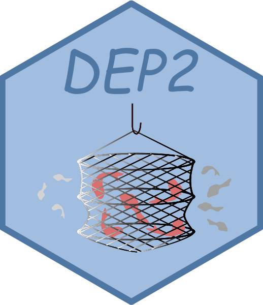

<!-- README.md is generated from README.Rmd. Please edit that file -->

# DEP2

<!-- badges: start -->
<!-- badges: end -->
<!--  -->
<!--  -->

DEP2 is a comprehensive analysis toolkit developed from the previous
package DEP for mass spectrometry based proteomics data. It offers
differential expression/enrichment analysis pipelines for various types
of data, such as protein-level quantity (e.g. proteingroup),
peptide-level quantity data, and modification-specific proteomics
(quantities of modified peptides). DEP2 not only encompasses functions
for data processing, hypothesis testing (via limma), and visualization
but also incorporates a pipeline for aggregating peptides into proteins.
To reduce the barrier in omics analysis, downstream functional
explorations are packaged as suites, including functional enrichment,
timecourse cluster and protein-protein interaction network. DEP2 also
contains an an easy-to-use shiny application designed with
modularization.

## Installation

You can install DEP2 from [GitHub](https://github.com/mildpiggy/DEP2)
using the following command:

``` r
# install.packages("devtools")
devtools::install_github("mildpiggy/DEP2")
```

Please note that DEP2 requires an R version higher than 4.1.0. We
recommend installing the latest R version from scratch to avoid any
compatibility issues with dependent packages. Additionally, for Apple
Mac, please make sure to have the
[Fortran](https://mac.r-project.org/tools/) compiler installed as it is
necessary for some dependencies.

## Check the suggested packages required in analysis

By default, DEP2 is installed with the essential dependent packages.
However, certain analysis modules may require additional suggested
packages. Users can run the following commands to complete the
functionality of DEP2:

``` r
library(DEP2)

# Check and install required packages for enrichment analysis.
DEP2::check_enrichment_depends(install = TRUE)

# Check and install the appropriate Anotation OrgDb for Human.
DEP2::check_organismDB_depends(organism = "Human",install = TRUE)
# The 'organism' parameter can also be specified with other species names, like Mouse, Rat. 

# Check and install required packages for PPI analysis.
DEP2::check_PPI_depends(install = TRUE)

# Check and install required packages for RNA-seq analysis.
DEP2::check_RNAseq_depends(install = TRUE)
```

Alternatively, you can install DEP2 with all suggested packages using
the following command:

``` r
devtools::install_github("mildpiggy/DEP2", dependencies = TRUE)
```

## Run shiny application

To run the built-in shiny application, use the run\_app function:

``` r
library(DEP2)
DEP2::run_app()
```

## Further information

For more information and details on the functionalities of DEP2, you can
visit the online [website](https://mildpiggy.github.io/DEP2/) or refer
to the built-in vignette after installation.
