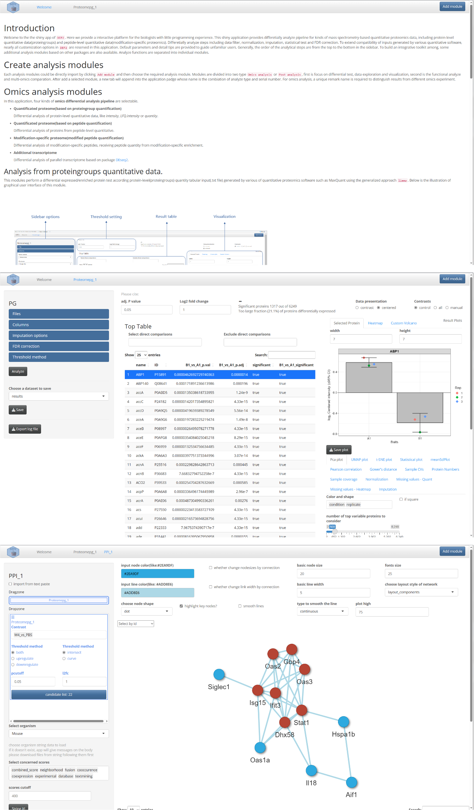
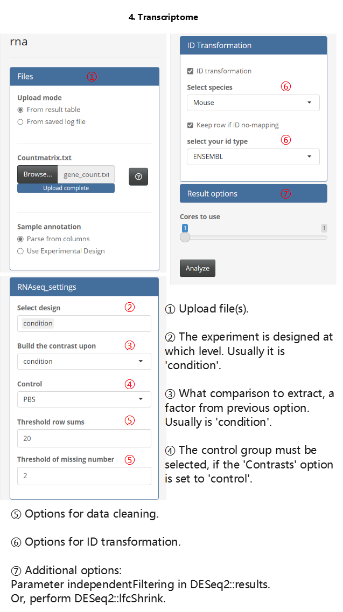
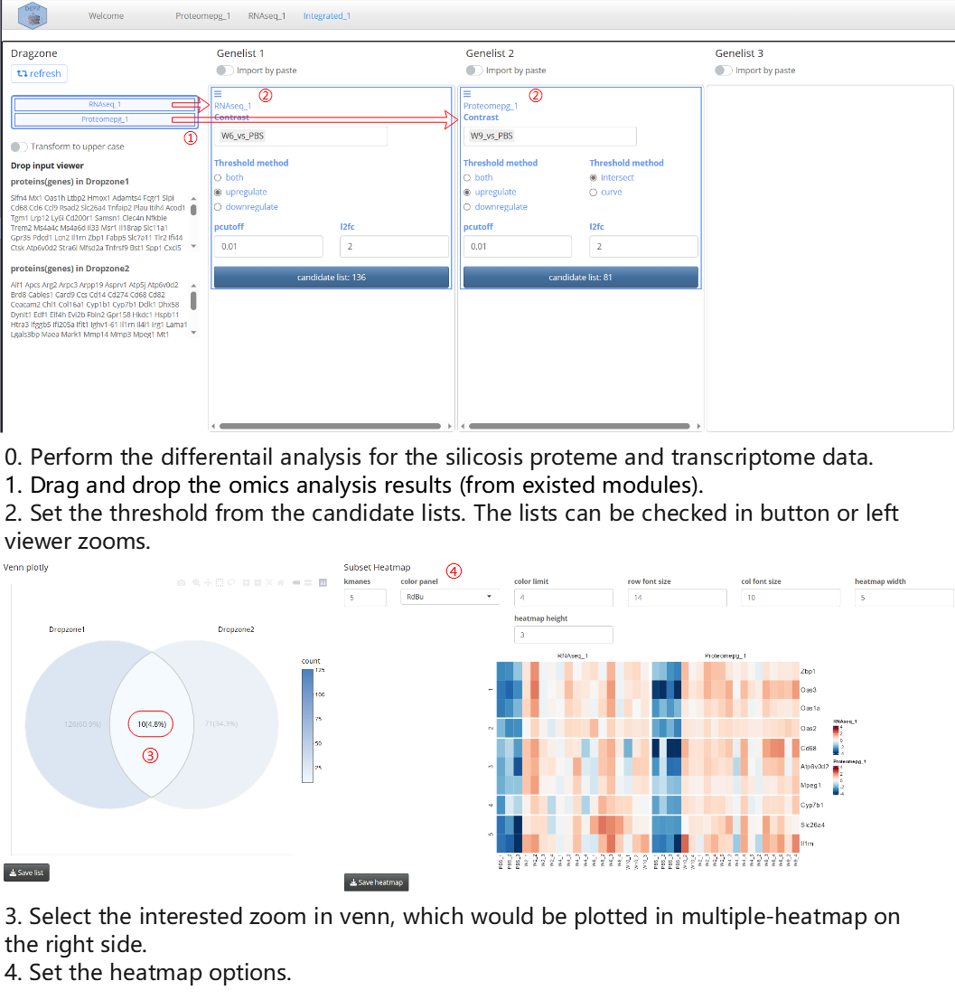

```{r, include=FALSE}
knitr::opts_chunk$set(echo = TRUE, fig.align="center")
```

# Introduction

DEP2 features an user-friendly shiny application designed for researchers without programming experience. The application provides an easy-used GUI for conducting various analysss in DEP2. In this section, we will briefly introduce the app operation. Example tables can be found in this [repository](https://github.com/mildpiggy/OmicsExample?_blank).


<br>
<br>

# Run App

The application can be launched by executing a single commond.

```{r run,eval=FALSE}
DEP2::run_app()
```

<br>
<br>

# Add Module

In DEP2, the shiny application follows a modular design, where different analysis functionalities are organized into separate modules. And modules can be imported by click the "Add module" button.


The app currently comprises following modules:

1. Omics modules

    - **Quantitative proteome (based on proteingroup quantification)**

        This module performs differential analysis of protein-level quantitative data, such as intensity, LFQ.intensity or quantity tables.

    - **Quantitative proteome (based on peptide quantification)**

        This module analyzes differentially expressed proteins by aggregating protein quantities from peptide-level quantitative data.

    - **Modification-specific proteome(modified peptide quantification)**

        This module analyzes differentially enriched modification-specific peptides using peptide quantity from modification-specific enrichment.
        
    - **Transcriptome (RNA counts)**
    
        This module utilizes DEseq2 to perform differential analysis of parallel transcriptome data.

2. Post analysis modules

    - **Over-representation analysis**
    
        This module performs biological functional enrichment using the function `test_ora`.
    
    - **GSEA**
    
        This module utilizes the function `test_gsea` for biological functional enrichment.
    
    - **Protein-protein interaction**
    
        This module constructs a Protein-Protein Interaction (PPI) network using a local STRING database through the function test_ppi. If local data is not available, the app will automatically attempt to download relevant data from an online database.
    
    - **Timecourse cluster**
    
        This module applies a soft cluster to assays comprised of multiple groups.
    
    - **Integrated analysis**
    
        This module allows for the comparison of results between omics experiments (note that PTM data is not yet supported).

<br>
<br>

# Omics Analysis Module


1. **Upload table**
    
Three type to upload table: 
        
  a. Uploading only an expression table, where the experiment design is generated from the expression column names. The column names must follow this format: (condition)_(repetition), for example, control_1, treat_1.

  b. Uploading both an expression table and an experiment design table. The experiment design table should contain three columns, "label", "condition" and "replicate". (The example file is expdesign.txt also can be found in the example repository)
        
  c. Uploading a saved log file from a previous analysis and recovering the analysis options.
        
The application accepts tables in *.txt* (tab separated), *.csv* (comma separated) or *.gz* (compressed table) format. The log file is in a *.logrds* format and can be used for future reference.
    


<br>

2. **Set columns options**

Specify the correct read-in options, including identifiers, expression values, and filter columns.


{width=1000px}

The options of removing suffix and removing prefix can affect the assay row names, and thus effect the 'label' columns in the ExperimentalDesign. For example, in this case, we remove the prefix, resulting in the following labels:

| Origin column name | label | condition | replicate  |
|--------------------|-------|-----------|------------|
| LFQ intensity A1_1 | A1_1  | A1        | 1          |
| LFQ intensity A1_2 | A1_2  | A1        | 2          |
| LFQ intensity A1_3 | A1_3  | A1        | 3          |
| LFQ intensity B1_1 | B1_1  | B1        | 1          |
| LFQ intensity B1_2 | B1_2  | B1        | 2          |
| LFQ intensity B1_3 | B1_3  | B1        | 3          |


Additionally, result files from other quantification software can also be imported using similar rules, but it is important to select the correct identifier and expression columns. The filter rule can be left blank as long as the features have already gone through quality control in the upstream software.

<br>

3. **Set analysis options**

Select the desired test mode.

{width=400px}

Other options can be adjusted in the option panels.


4. **peptide-protein aggregation pipeline**
Besides, the peptide-protein aggregation pipeline contains two main calculate steps: aggregation and differential testing. These steps should be performed sequentially within the module.


<br>


5. **Transcriptome analysis**

The usage of the Transcriptome analysis module is similar to that of the proteome modules, but there are still some differences, such as the options for ID transformation. An illustrated example is provided below.



<br>

6. **Result export**

Save table


Save log file. The log file stores test options and intermediate results, which can be used to recover the analysis in future sessions. Please note that although the file types of the log files exported from four omics analysis modules are the same, they do have different data formats. Therefore, they can only be imported using the corresponding analysis module (for specific instructions, please refer to the previous section).


<br>
<br>

# Post analysis

It is important to note that post analysis functionalities are not completed when DEP2 is installed in default.  Users can complete these functionalities by executing the "check_" series of functions. 

```{r warning=FALSE,message=FALSE}
## Check required packages for enrichment analysis
DEP2::check_enrichment_depends()

## Check required packages for PPI
DEP2::check_PPI_depends()
```

As an alternative approach (but one that we do not recommend), users can also choose to proactively specify the installation of all dependent packages when installing DEP2.

```{r eval=FALSE}
## Install all depend packages at once by setting 'dependencies = TRUE'
devtools::install_github("mildpiggy/DEP2", dependencies = TRUE)
```

Besides, functional analyses (functional enrichment or PPI) require species annotation database packages in the R environment. Therefore, the relevant packages must be installed before conducting functional analysis for any organism. You can run the function `check_organismDB_depends` in the console to check or install the missing packages, which can extend the selectable species options in the app. Here is an example code:

```{r eval=FALSE}
## Check organism annotation package of a species
## Parameter organism could one of "Chicken", "Human", "Mouse", "Rat", etc.
DEP2::check_organismDB_depends(organism = "Human")
```

Note: The command above should be executed in the console before running the app.

<br>

## Annotation Enrichment (ORA or GSEA)

You can perform post-functional analyses directly on existing omics analysis datasets. However, it is essential to note that the app considers the identifiers as symbols. Therefore, selecting the gene symbol column as the 'name' in the column options is a prerequisite for post-analysis.


<br>

## Protein-protein Interaction network

To enable the PPI modules after installing DEP2 for the first time, you need to run the `check_PPI_depends` function in the console before running the app.

```{r eval=FALSE}
DEP2::check_PPI_depends()
```


<br>
<br>

## Integrated analysis

The Integrated analysis module can generate venn plot and heatmap for multiple omics results. Here, we showcase the usage of the module through a parallel proteome and transcriptome study on the silicosis mouse.



Note: In order to compare results from different omics analyses, it is necessary to standardize the identifier types of features. For the proteome modules, this depends on the gene name option, while for the transcriptome module, the non-gene name identifiers are transformed to symbols using an annotation database.

<br>

# Reshape table

The proteome analysis modules only accept wide quantitative table, where each row represents a features (such as a protein or a proteingroup), and rows contain the identification information and quantification information of samples. However, long-format tables are also widely used in many cases, where each quantity value is represented in a separate row. Therefore, DEP2 offers the `reshape_long2wide` function, and APP also offers the Reshape module for converting long table into wide-format. Here, we demonstrate how to analyze the DIA-NN result file, report.tsv, which is in the long-format.


For the import of other long-format tables, similar settings can be referred to the above process. The module can also reshape data at the peptide level. For more details, refer to the documentation of the `reshape_long2wide` function and the `Data import` vignette. 


