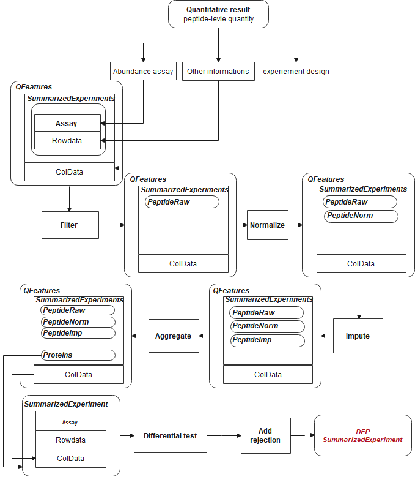

```{r opts ,include = FALSE}
knitr::opts_chunk$set(
  collapse = T,
  eval = T,
  comment = "#>"
  # ,fig.path = "man/figures/README-"
  # ,out.width = "100%"
)
```

```{r library, include=FALSE}
suppressPackageStartupMessages({
  # devtools::load_all()
  library(BiocStyle)
  library(tidyr)
  library(DEP2)
  library(SummarizedExperiment)
  library(tibble)
  library(tidyr)
  library(dplyr)
  library(ggplot2)
  library(missForest)
  library(patchwork)
  library(ggridges)
})
```

# Introduction

`DEP2` is a downstream analysis toolkit for mass spectrometry based quantitative proteomics data. The package contains an integrated workflow for proteomics analysis, including data processing, missing value imputation, hypothesis test, visualization and downstream function exploration. It accepts various of proteomics results generated by upstream search and quantitative software and provides function to format table. In the vignette, we use the built-in data in DEP2. The native tables out from upstream software are available in this [repository](https://github.com/mildpiggy/OmicsExample?_blank). 

Now, `DEP2` provide three types of differential proteomics analysis:

1.  The pipeline for proteins-level expression/enrichment analysis, started from protein-level quantity.

    This pipeline is basically follows the methods in `DEP`, requires a protein-level quantity result (e.g. proteingroups.txt).

2.  The pipeline for proteins-level expression/enrichment analysis, started from peptide-level quantity.

    This pipeline clustered the peptide to protein summarization strategies in `QFeatures`, requires a protein-level quantity (e.g. peptide.txt).

3.  The pipeline for post-translation modification (PTM) specified proteomics, performed upon modified peptides quantity.

    This ppipline derived from the first one, and concludes the additional modification information in analysis.

Besides, DEP2 packages a classical RNA-seq analysis from DESeq2. Downstream exploration functions are also coupled into workflow, including: functional enrichment provided by `r Biocpkg("clusterProfiler")` [@Wu:2021] and `r Biocpkg("ReactomePA")``; protein-protein interaction inference from STRING database; and time-course expression pattern clustering though cmeans cluster. As an optional function, DEP2 also packaged a RNA-seq data analysis pipeline.


# Differentially expression analysis

The steps of four analysis pipelines are slightly different. 

## Analysis proteomics data using protein-level results


**Load data**


```{r Load}
## ProteinGroups table
data("Silicosis_pg")

## Formatting name(gene symbol) and id(protein ID). 
## Generate a unique names for each protein. names and ids are columns in table
unique_pg <- make_unique(Silicosis_pg, names = "Gene.names", 
                         ids = "Protein.IDs", delim = ";") 
```

**Convert SE object**

```{r se1}
## Take expression columns(LFQ intensity in this cases).
ecols <- grep("LFQ.intensity.", colnames(unique_pg))

## Construct SE. The experiement design is exctracted from column.
se_pg <- DEP2::make_se_parse(unique_pg, columns = ecols, mode = "delim", 
                             sep = "_", remove_prefix = T, log2transform = T)
```

**Filter**

Undesired features, like reverse sequences or contaminant protein hits, may contain in the result table. Besides, missing values (MVs) is inevasible label-free MS-based proteomics especially for DDA data. Filter out reverse, contaminant, and low quality features with many missing is required for following statistical test. `filter_se` can filter features based on either MVs threshold or other giving criterion.

```{r filter pg, collapse=T}
## Filter on MVs.
filter_pg <- filter_se(se_pg,
                       thr = 1,  ## the threshold of missing number in at least one condition
                       fraction = 0.3 ## the threshold of missing occupancy in each protein
                       
                      )

## Further filter can be performed though filter_formula.
### Fox example, remove decoys or contaminants.
filter_pg <- filter_se(filter_pg,
                       filter_formula = ~ Reverse != '+' & Potential.contaminant !="+" ## filter upon Reverse and contaminant
                      )
### Or set a unique.peptide threshold.
filter_pg <- filter_se(filter_pg,
                       filter_formula = ~ Unique.peptides > 0)


get_df_wide(se_pg)$Reverse %>% table
get_df_wide(filter_pg)$Reverse %>% table

(plot_frequency(se_pg) + ggtitle("Identification overlap before filter")) / 
  (plot_frequency(filter_pg) + ggtitle("Identification overlap after before filter"))
```

**Normalization**

In the DEP and DEP2 workflow, assay is log2-transformed during SE construction. Next, proteingroup assay is further normalized by variance stabilizing transformation(vsn). 

```{r message=FALSE}
norm_pg <- normalize_vsn(filter_pg)

plot_normalization(filter_pg, norm_pg)
```


**imputation**

A considerable proportion of MVs still remain in the assay after filtering.

```{r missing heatmap, message=FALSE}
plot_missval(filter_pg)
```

MVs can be divided into missing at random (MAR), missing at random (MAR) and missing not at random (MNAR), based on NA frequency intensity signal. Function `DEP2::impute` draws kinds of imputation on SE object. Inheriting from DEP, `impute` cluster the imputation functions from `r Biocpkg("MSnbase")` and `r Biocpkg("MsCoreUtils")`, including following methods.

-- Left-censored imputation methods, replace: *"MinDet", "MinProb", "min"(LOD), "QRILC", "zero", "man"(impute by a left-shifted distribution)*

-- local similarity methods: *"knn", "nbavg"*

-- Global-structure methods: *"MLE", "BPCA"*

Further detials can view the vignettes in `r Biocpkg("DEP")` and `r Biocpkg("MSnbase")`. In additional, DEP2 clusters two machine learning based imputation in `impute`: *"RF"* and *"GSimp"*. "RF" call the `missForest::missForest`, which train a random forest based on observed parts of dataset. And "GSimp" is a Gibbs sampler based left-censored imputation method proposed by [Runmin Wei, Jingye Wang, etc](http:s//doi.org/10.1371/journal.%20pcbi.1005973). These two methods take a long time on iteration but are reported that could draw a better estimation on missing values.

```{r impute, collapse=T}
set.seed(35)
sample_rows <- sample(1:nrow(norm_pg), 300)
norm_pg_sample = norm_pg[sample_rows,] # random sample 150 features to reduce runing time
plot_detect(norm_pg_sample)

## Impute missing data using random draws from a Gaussian distribution centered around a minimal value (for MNAR)
imp_pg_MinProb <- DEP2::impute(norm_pg_sample, fun = "MinProb", q = 0.01)

## Impute missing data using k-nearest neighbour approach
imp_pg_knn <- DEP2::impute(norm_pg_sample, fun = "knn")

## Impute missing data using missForest
imp_pg_RF <- DEP2::impute(norm_pg_sample, fun = "RF", ntree = 50, mtry = 5) 

## Impute missing data using Gibbs
imp_pg_GSimp <- DEP2::impute(norm_pg_sample, fun = "GSimp", hi_q = 0.1,
                       iters_each=40, iters_all=8)

## Impute missing data using QRILC
imp_pg_QRILC <- DEP2::impute(norm_pg_sample, fun = "QRILC") 
```

The distribution of mean intensity of missing or non-missing proteingroups

```{r message=FALSE}
plot_detect(norm_pg_sample)
```
The difference among imputation methods.
```{r compare imp}
NAs <- is.na(assay(norm_pg_sample)) 
## the imputed values by different methods.
imps <- list("GSimp" = imp_pg_GSimp, "QRILC" = imp_pg_QRILC, "MinProb" = imp_pg_MinProb, "RF" = imp_pg_RF, "knn" = imp_pg_knn) %>% 
  lapply(function(se){
    x = assay(se) %>% data.frame %>% gather("label", "value") %>% 
      left_join(colData(se)[c("label","condition")],copy = T) %>%
      magrittr::extract(as.vector(NAs),)
  }) %>% data.table::rbindlist(idcol = "method")

## the original normalized values without imputation
nonimps <- assay(norm_pg_sample) %>% data.frame %>% gather("label", "value") %>%
  left_join(colData(norm_pg_sample)[c("label","condition")],copy = T) %>% 
  magrittr::extract(!as.vector(NAs),) %>% mutate(method = "non_impute") %>%
  dplyr::select(method,everything())

library(ggridges)
ggplot(rbind(imps, nonimps),aes(x = value,y = factor(method,level = unique(method)))) + 
  geom_density_ridges(fill = "#027ad450", scale = 1.2,
                      jittered_points = TRUE,position = position_points_jitter(height = 0),
                      point_shape = '|', point_size = 2, point_alpha = 1, alpha = 0.7) +
  ylab("Impute method")+ ylab("Log2 value") + xlim(c(9,39))+
  theme_DEP1()
```


Left-censored approaches, like MinProb and GSimp replace MVs by conservatively low values; local similarity method "knn" and global data learning "RF" impute relatively larger values. .These two method cater to MNAR and MAR respectively. But "knn" will impute a mean value when the row contains more than 50% missing.


```{r rmtemp}
rm(list = c("norm_pg_sample", "imp_pg_knn","imp_pg_MinProb","imp_pg_RF","imp_pg_GSimp"))
## Impute missing data using q-th quantile for following analysis
imp_pg <- impute(norm_pg, fun = "MinDet" ,q = 0.01)
```


**Hypothesis test**

Function `test_diff` perform a moderated t-test from limma. In DEP, p values is corrected by the `fdrtool` to classify significantly regulated/enriched candidates and stable proteins. DEP2 additionally provides two alternative frequently-used FDR control method, *"Benjamini-Hochberg fdr"* and *"Storey's qvalue"*.

```{r testdiff}
## Test every sample versus PBS control
diff_pg <- test_diff(imp_pg, type = "control", control = "PBS", fdr.type = "BH")
## Test on manul contrasts
diff_pg2 <- test_diff(imp_pg, type = "manual", test  = c("W4_vs_PBS"), fdr.type = "Storey's qvalue")
```

Function `add_rejections` can classify significant hits according L2FC (*lfc*) and adjusted p value (*alpha*) threshold.

```{r rejections1}
## Add significant rejections for features, based on 
dep_pg <- add_rejections(diff_pg, alpha = 0.01, lfc = 2)

## get the significant subset
dep_pg_sig <- get_signicant(dep_pg)
nrow(dep_pg_sig)
```

Use the `plot_volcano` to have a quick look on result.

```{r rejections plot 1}
### volcano plot on contrast "W4_vs_PBS"
plot_volcano(dep_pg, contrast = "W4_vs_PBS", adjusted = F)
## plot the cutoff line
plot_volcano(dep_pg, contrast = "W4_vs_PBS", adjusted = F,
             add_threshold_line = "intersect", pCutoff  = 0.05, fcCutoff = 1)
```

Besides the intersect method, add_rejections can draw a curve cutoff approach described by [Eva C.Keilhauer](https://www.sciencedirect.com/science/article/pii/S1535947620316674). Instead of intersect straight lines, the approach used curve lines with $y > c/(x - x_0)$, where $x$ is the log2 FC, $y$ is adjusted P value of features (*c* = curvature, *x[0]* = minimum L2FC). We use the standard deviation $\sigma$ determine x0 by $x_0 = x_0.fold*\sigma$. $\sigma$ is the standard deviation of the Gaussian curve distribution of log2 FC in each contrast.

```{r rejections2,fig.height=7}
## thresholdmethod = "curve"
dep_pg_curve <- add_rejections(diff_pg, thresholdmethod = "curve", curvature  = 2, x0_fold = 2)

## the cutoff line on volcano
plot_volcano(dep_pg_curve, contrast = "W4_vs_PBS", add_threshold_line = "curve", curvature = 2, x0_fold = 2) /
  plot_volcano(dep_pg_curve, contrast = "W6_vs_PBS", add_threshold_line = "curve", curvature = 2, x0_fold = 2)

```

You can check the $\sigma$ and fitted Gaussian curve by `plot_diff_hist`.

```{r}
## Check the fitted Gaussian curve
plot_diff_hist(dep_pg_curve, contrasts = c("W4_vs_PBS", "W6_vs_PBS"))

## Get the fit result 
plot_diff_hist(dep_pg_curve, plot = F) ## a table of gaussian args \sigma and \mu
```

`plot_heatmap` can plot a heatmap for significant candidates.

```{r heatmap,collapse=T}
plot_heatmap(dep_pg)

## Reorder columns by condition
dep_pg = DEP2::Order_cols(dep_pg,order = c("PBS","W2","W4","W6","W9","W10"))
plot_heatmap(dep_pg, cluster_columns = F, kmeans = T, k = 5, seed = 1) # cluster features

## Only plot the clusters that are up-regulated in treatment groups.
plot_heatmap(dep_pg, cluster_columns = F, kmeans = T, k = 5, seed = 1, col_limit = 4,
             split_order = c(1,2,5)
             )
## plot on select contrast
plot_heatmap(dep_pg, manual_contrast = "W4_vs_PBS")
```

## Analysis based on protein re-aggregation

The second pipeline is aggregation protein abundance from peptide quantity data. The analysis workflow is different to last one in data processing steps.



**Load data**

```{r MQ_pep2}
data("Silicosis_peptide")
```

**Convert a QFeatures object**

```{r}
## Here we just select two groups to save computational cost in these vignette
(ecols <- grep("Intensity.PBS|Intensity.W4", colnames(Silicosis_peptide), value = T)) 

pe <- make_pe_parse(Silicosis_peptide, columns = ecols, mode = "delim")
pe
```

**Filter**

QFeatures object can be filtered though by `filter_pe`. Its usage is similar to function `filter_se`, could filter out unexpected features by missing ratio or based on identification information in certain rowdata columns.

<!-- ```{r filter pe,include=F,eval=FALSE} -->

<!-- ## Sample 800 protein ID as example, to reduce computational cost in these vignette -->

<!-- set.seed(50) -->

<!-- pe_peptides -->

<!-- sample_protein = sample(unique(Silicosis_peptide$Proteins),1000) -->

<!-- pe_peptides2 <- filter_pe(pe_peptides, filter_formula = ~ Proteins %in% sample_protein) -->

<!-- pe_peptides2 -->

<!-- ## fitlt out low quality peptides -->

<!-- filt_pe <- filter_pe(pe_peptides2, thr = 1,fraction = 0.4, filter_formula = ~ Reverse != '+' & Potential.contaminant !="+" ) -->

<!-- ``` -->

```{r filter pe}
filt_pe <- filter_pe(pe, 
                     thr = 1,fraction = 0.4,  ## filter based on missing values
                     filter_formula = ~ Reverse != '+' & Potential.contaminant !="+" )
```

**imputation**

Imputation could perform before normalization, to reduce the potential effect caused by MVs.

```{r imp pe, message=FALSE}
## Use QFeatures::addAssay() and DEP2::impute
pe <- QFeatures::addAssay(filt_pe,
                              DEP2::impute(filt_pe[["peptideRaw"]], fun = "QRILC"), 
                              name = "peptideImp")
plot_imputation(pe[["peptideRaw"]], pe[["peptideImp"]])
```

**Normalization**

Function `normalize_pe` perform normalize and call `QFeatures:normalize`. Four normalization methods are selectable., including *"diff.median", "quantiles", "quantiles.robust" ,"vsn"*. Notice that *quantiles.robust* can't handle data table with MVs (ie NA). Therefore It is necessary to Imputate in advance .

```{r imp before norm2}
pe <- DEP2:::normalize_pe(pe,method = "quantiles.robust",
                               i = "peptideImp",    ## nomalize on which assay
                               name = "peptideNorm" ## output assay name
                               )

plot_normalization(pe[["peptideRaw"]],pe[["peptideImp"]],pe[["peptideNorm"]])

```

**Aggregation**

DEP2 packaged function `aggregate_pe` based on `QFeatures::aggregateFeatures`. The summarisation approach *aggrefun* can be "RobustSummary" (also called MSqRobSum) [@Sticker:2020], "medianPolish", "totalMean". Details can see `?aggregateFeatures`. And proteingroups can be summed by "Unique + Razor" or "Unique". `aggregate_pe` require several minutes depend on the peptide assay scale.

```{r aggrega}
begin_time = Sys.time()

pe <- DEP2::aggregate_pe(pe,
                         aggrefun = "RobustSummary",
                         aggregate_Peptide_Type = "Unique + Razor",
                         fcol = "Proteins",                  # the protein ID column in input table
                         i = "peptideNorm", # the assay to aggregate
                         reserve = "Gene.names"              # reserve the Gene.names in row data.
)

print(Sys.time() - begin_time) # aggregate cost several minutes depent on the assay scale

pe # protein result is in the protein assay
se_pep <- pe2se(pe, names = "Gene.names", ids = "smallestProteingroups")
```

**Differential test** Following differential test is same to the proteingroups pipeline. Use `test_diff` and `add_rejections` to classify significant protein.

```{r}
## Differential test
diff_pep <- DEP2::test_diff(se_pep,type = "control", control = "PBS", fdr.type = "BH")
## Add rejections
dep_pep <- add_rejections(diff_pep,alpha = 0.01, lfc = 2)
get_signicant(dep_pep) %>% nrow
```

Data visualization functions is also worked for DEP results from re-aggregation.

```{r DEP visualization}
## Volcano
plot_volcano(dep_pep, contrast = "W4_vs_PBS", add_threshold_line = "intersect") 
## Heatmap
plot_heatmap(dep_pep, kmeans = T,k = 5,col_limit = 6) 
```

## Analysis for PTM-specific proteomics

DEP2 designs a new workflow for post-modification proteomics data analysis begin from modified peptides quantitative result. The post-translation modification information is necessary to distinguish modified sites, including position, modified residue (amino acid), gene name or protein ID that modification is associated with. 

`make_unique_ptm` creates(or overwrites) the PTM information columns, including *name*, *ID*, *gene_name*, *protein_ID*, *modified_aa*, *modified_pos*. The *name*, *ID* columns is the identifier of each modified-peptide, following such naming rule: '(gene name/protein ID)_(modified amino acid)(position of modification)' (e.g. "TBCA_K51" and "O75347_K51").

**Load data**

The example we used here is the phosphorylated peptide result, table **Phospho (STY)Sites.txt**, from MaxQuant. In the table

```{R ptm_load}
## phosphorylated peptides table of the silicosis mouse model.
data(Silicosis_phos) 

## Format the modification information and generated modified-peptides identifier.
## aa and pos is the modified amino acids and modified site in protein.
unique_pho <- make_unique_ptm(Silicosis_phos, gene_name = "Gene.names", 
                              protein_ID = "Protein", aa = "Amino.acid",
                              pos = "Position") 
```

The *name*, *ID* is generated upon PTM information columns. 

```{r}
DT::datatable(unique_pho[1:7,c("name","ID","Gene.names","Protein","Amino.acid","Position")],
              options = list(scrollX = T,pageLength = 7))
```

**Covert SE** 

```{r ptm_make_se}
## Take 'Intensity' columns.
ecols <- grep("Intensity.", colnames(unique_pho))

## Construct a SE object mentioned before.
se_ptm <- make_se_parse(unique_pho, columns = ecols, 
                        mode = "delim", sep = "_", remove_prefix = T, log2transform = T)
```


**Filter** 

The following steps is Basically similar to the protomics analysis pipeline. `filter_se` are a universal filter function for SE object. A additional threshold should be set on 'Localization.prob' in the MaxQuant modification result.

```{r message=FALSE, warning=FALSE, message=FALSE}
## Filter base on both missing occupancy and the localization probability for this site.
filt_ptm <- filter_se(se_ptm, 
                      thr = 1, fraction = 0.3, 
                      filter_formula = ~ Reverse!="+" & 
                        Potential.contaminant!="+" & 
                        Localization.prob>0.7
                      )
```

**Normalization**
```{r PTM_norma}
## VSN normalization
norm_ptm <- normalize_vsn(filt_ptm)
```

**Imputation**
```{r PTM_imp}
## KNN impute relatively larger values
imp_ptm <- impute(filt_ptm, fun= "knn")
```

**Differantail test**
```{r }
diff_ptm <- test_diff(imp_ptm, type = "manual", test = "PBS_vs_W6" , fdr.type = "BH")

dep_ptm <- DEP2::add_rejections(diff_ptm, alpha = 0.05, lfc = 1)
plot_volcano(dep_ptm,adjusted = T, add_threshold_line = "intersect")
```


## Analysis RNA-seq data

Multi-omics study has already become a widespread method in research. In particular, proteomics-transcriptomics combined studies can reveal regulation details, from multiple perspectives. Thus DEP2 packages a pipeline for RNA-seq data from DESeq2. here. 

**Load data**

```{r rna_load}
data(Silicosis_counts)
DT::datatable(head(Silicosis_counts), options = list(scrollX = T,pageLength = 6))
```

**Construct DESeqDataSet**

```{r rna_dds1}
dds <- make_dds_parse(Silicosis_counts,mode = "delim")
dds
```

**Filter**

*DESeqDataSet* inherits from *SummarizedExperiment*

```{r}
## 
inherits(dds,"SummarizedExperiment")
```

`Filter_se` can also filter *DESeqDataSet* objects. Parameter *rowsum_threshold* set threshold on counts row sum.

```{r rna_filter}
dds <- filter_se(dds, fraction = 0.3, thr = 1, rowsum_threshold = 35)
```

**Transform ID**

In this case, the gene identifier is Ensembl ID. In order to check the gene conveniently, DEP2 can transform ID to gene symbol through the [OrgDb]("http://www.bioconductor.org/packages/release/BiocViews.html#___OrgDb") databases. `ID_transform` can perform the ID convert and replace the rownames of the object.

```{r rna_transformid}
## Check if the annotation package is already installed.
check_organismDB_depends(organism = "Mouse")

head(rownames(dds),4)

## Transform ID
dds <- DEP2::ID_transform(dds, species = "Mouse")
head(rownames(dds),4)
```

If needed, `ID_transform` can be used on proteinomics data, for example:
```{r dep_transformid, eval=FALSE}
DEP2::ID_transform(dep_pg, 
                   species = "Mouse",
                   from_columns = "ID",
                   fromtype = "UNIPROT")
```

**Differential test**

The differential test step is similar to the foregoing pipelines, but the `test_diff` is replace by `test_diff_deg` to call *DESeq2*.

```{r rna_test}
diff <- test_diff_deg(dds, type = "control", control = "PBS")

deg <- add_rejections(diff, alpha = 0.01, lfc = 1)
```

`test_diff_deg` 


# Export result table

Function `get_results` can get the result table (or significant subset) from differential test results.

```{r table1}
## Get result table
DT::datatable(head(get_results(dep_pg)), options = list(scrollX = T,pageLength = 5))
```


```{r subset1}
## Get the significant subset
sig_deg = get_results(deg)
class(sig_deg)
```

Function `get_df_wide` can get the full table from a DEP result.

```{r table2}
## Get full data set with row information.
DT::datatable(head(get_df_wide(dep_pg)), options = list(scrollX = T,pageLength = 5))
```

Function `get_df_wide` can get results of significant candidates.

```{r table3}
## Get full data set of significant features
get_signicant(dep_pg,return_type = "table") %>% dplyr::select(ends_with("significant")) %>% 
  summary
```

# Result comparation

After . `plot_multi_venn` and `plot_multi_heatmap` can directly compare the significant result from two omics experiments via name identifiers.

Use `plot_multi_venn` to compare the differentce between two pipelines (analysis from MQ proteingroups or the peptides re-aggregation pipeline).

```{r comparation,message=FALSE}
## Test on the contrast W4_vs_PBS.
diff_pg <- test_diff(imp_pg, type = "manual", test  = c("W4_vs_PBS"), fdr.type = "Storey's qvalue")
dep_pg <- diff_pg %>% add_rejections(alpha = 0.05,lfc = 2)
diff_pep <- DEP2::test_diff(se_pep,type = "control", control = "PBS", fdr.type = "Storey's qvalue")
dep_pep <- add_rejections(diff_pep,alpha = 0.05, lfc =2)

## Filter out pg quantified which only have one peptides.
dep_pep = filter_se(dep_pep,filter_formula = ~.n  > 2)
dep_pg = filter_se(dep_pg,filter_formula = ~Razor...unique.peptides  > 2)

## Plot Venn to explore the difference between two ways.
plot_multi_venn(omics_list = list(PG= dep_pg, pep=dep_pep))
```

```{r comparation2,,message=FALSE}
## If set the proteins remained in both result as background. 
## dep_pep only contain two conditions of the study. PBS and W4. See the pe_peptides above.
overlap_protein = intersect(rownames(dep_pep), rownames(dep_pg))
plot_multi_venn(omics_list = list(PG= dep_pg, pep=dep_pep), background = overlap_protein)
```

Check the expression of interested proteins/genes accorss omics via `plot_multi_heatmap`.
Here we take some proteins may be related to IL-1 signaling, the signaling pathway that is reported to be upregulated in silicosis mouse model in the original paper.

```{r mulheatmap}
## Take the proteins may response to interleukin-1 as an example.
IL1_relative_genes <-c("Irg1", "Il1rn", "Saa3", "Zbp1", "Ccl6", 
                       "Serpine1", "Ccl21a", "Pycard", "Irak2", "Vrk2", 
                       "Fn1", "Il1r1", "Irf1", "Ccl9", "Mapk11", "Tank", 
                       "Mapk13")

## Order the samples by time.
dep_pg <- Order_cols(dep_pg, order = c("PBS","W2","W4","W6","W9","W10"))

## Plot the heatmap upon two DEP results.
plot_multi_heatmap(omics_list = list(PG= dep_pg, pep=dep_pep),
                   choose_name = IL1_relative_genes,
                   width = 4)
```

# Post analysis

To reduce the barriers in format conversion between deferential test and downstream analysis, post analysis suites for DEP results is available in DEP2.

## Biological function enrichment

Biological functional enrichment functions from `r Biocpkg("enrichR")`, `r Biocpkg("clusterProfiler")` and `r Biocpkg("ReactomePA")` are packaged in `test_ORA` and `test_GSEA` to perform over enrichment analysis upon results output from `test_diff` and `add_rejection`. Objective gene/protein list is extracted. Then IDs are transformed though organism annotation data, and further mapped biological knowledge annotated gene sets. 

`test_ORA` can perform enrichment analysis upon Gene ontology, KEGG or REACTOME data.

```{r enrichment, message=FALSE, warning=FALSE}
## 1. Extract gene list
diff_pg <- test_diff(imp_pg, type = "manual", test  = c("W4_vs_PBS"), fdr.type = "Storey's qvalue")
dep_pg <- diff_pg %>% add_rejections(alpha = 0.01,lfc = 2)

## 2. Check install
check_enrichment_depends() # check required packages
check_organismDB_depends("Mouse") # organism annotation for mouse

## Over representation analysis
# On one contrast
res_ora <- test_ORA(dep_pg, contrasts = "W4_vs_PBS", species = "Mouse",type = "GO")

class(res_ora) 

# On each contrasts
res_ora2 <- test_ORA(dep_pg, by_contrast = T, species = "Mouse",type = "GO")

class(res_ora2)

## Gene set enrichment analysis
res_gsea <- DEP2::test_GSEA(dep_pg, by_contrast = F, species = "Mouse",type = "GO")

class(res_gsea)
```

The output of `test_ORA` and `test_GSEA`  is the same object as from source functions, which is seamlessly compatible for plot functions and manipulate function provided for *enrichR* result. The visualization methods from `r Biocpkg("enrichplot")` package can seamlessly draw on output of these two output.

```{r dotplot,message=FALSE}
## Dotplot function from DOSE package
library(enrichplot)
enrichplot::dotplot(res_ora)
```

```{r gesaplot}
## GSEA plot on one category
enrichplot::gseaplot(res_gsea,geneSetID = "GO:0071347")
```

**cnet** on interested biological process which enriched in GSEA.
```{r cnet}
## Cnetplot
res_gsea2 <- res_gsea %>% 
  filter(ID %in% c("GO:0071347","GO:0035329","GO:0032660","GO:0090263","GO:0035456","GO:0038061"))
cnetplot(res_gsea2,foldChange = res_gsea@geneList,node_label = "category",showCategory = 6)
```

More usages and details are available the Yu's introduction [biomedical-knowledge-mining-book](https://yulab-smu.top/biomedical-knowledge-mining-book/).


## Expression pattern cluster

In the time-course omics studies or the experiments with complex group design, it's not easy to find out key candidates across entire experiment from cumbersome contrasts. DEP2 provides a `get_tc_cluster` function to perform timecourse cluster for omics data with multiple groups. It cluster features by "cmeans", and return a list contains heatmap plot and cluster result. In the omics experiement with multiple experimental groups, `get_tc_cluster` can classify genes/proteins according to their expression patterns.

```{r tcheatmap,fig.height=14}
## Perform cluster on signicant protein in all contrast
tc_pg <- get_tc_cluster(get_signicant(dep_pg),
               group_order = c("PBS","W2","W4","W6","W9","W10") # Set group order
              )
## Time course heatmap
tc_pg$ht
```


```{r tcheatmap2}
## Expression cluster on phospholated sites
tc_ptm <- get_tc_cluster(get_signicant(dep_ptm),
                         group_order = c("PBS","W2","W4","W6","W9","W10"), # Set group order
                         row_font_size = 0,
                         k = 8,
                         heatmap_height = 2
)
tc_ptm$ht
```

The output of `get_tc_cluster` contains a heatmap combined with expression line chart and a cluster result table in store in the 'res' slot. The cluster table is a data.frame recording the closest cluster, membership values and expression values.
```{r tcres}
## The clustering result table
DT::datatable(head(tc_pg$res), options = list(scrollX = T,pageLength = 6))
```


## Protein-protein interaction

DEP2 provides a function `test_PPI` to construct protein-protein interaction network though STRING data. `test_PPI` perform PPI analysis locally and will download the species data from STRING. Notably, `test_PPI` use a local STRING data. Function `load_PPIdata` checks whether local database is exist. If STRING data is absent, `load_PPIdata` and `test_PPI` will try to download the PPI data of the species from website and save in `r system.file("PPIdata", "species_name",package = "DEP2")`. 

```{r PPI1,warning=FALSE,eval=TRUE,message=FALSE}
# 1. Check required packages for network construction.
check_PPI_depends()

# 2. Load STRING data. 
## If local STRING is missing, load_PPIdata will download to system.file("PPIdata", "Mouse",package = "DEP2")
load_PPIdata(speciesname = "Mouse") 

# 3.Load STRING data and perform PPI analysis. 
## It also automatically download data if loacl files is missing. 
PPI_res <- test_PPI(
  dep_pg,
  contrasts = "W4_vs_PBS",
  species = "Mouse",
  STRING.version = "11.5",
  score_cutoff = 400
)

# igraph network
PPI_ig <- PPInetwork(PPI_res,returntype = "igraph")
igraph::plot.igraph(PPI_ig)

```

```{r PPI2,eval=FALSE,fig.height=8}
## visNetwork network
PPInetwork(PPI_res,returntype = "visNetwork") 
```


# Session information 

```{r sessioninfo, echo=FALSE}
sessionInfo()
```

# References 
