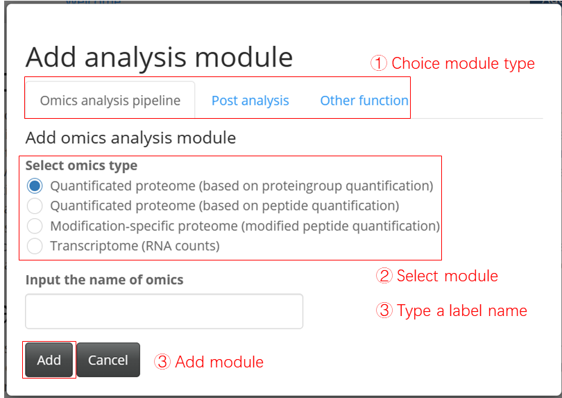
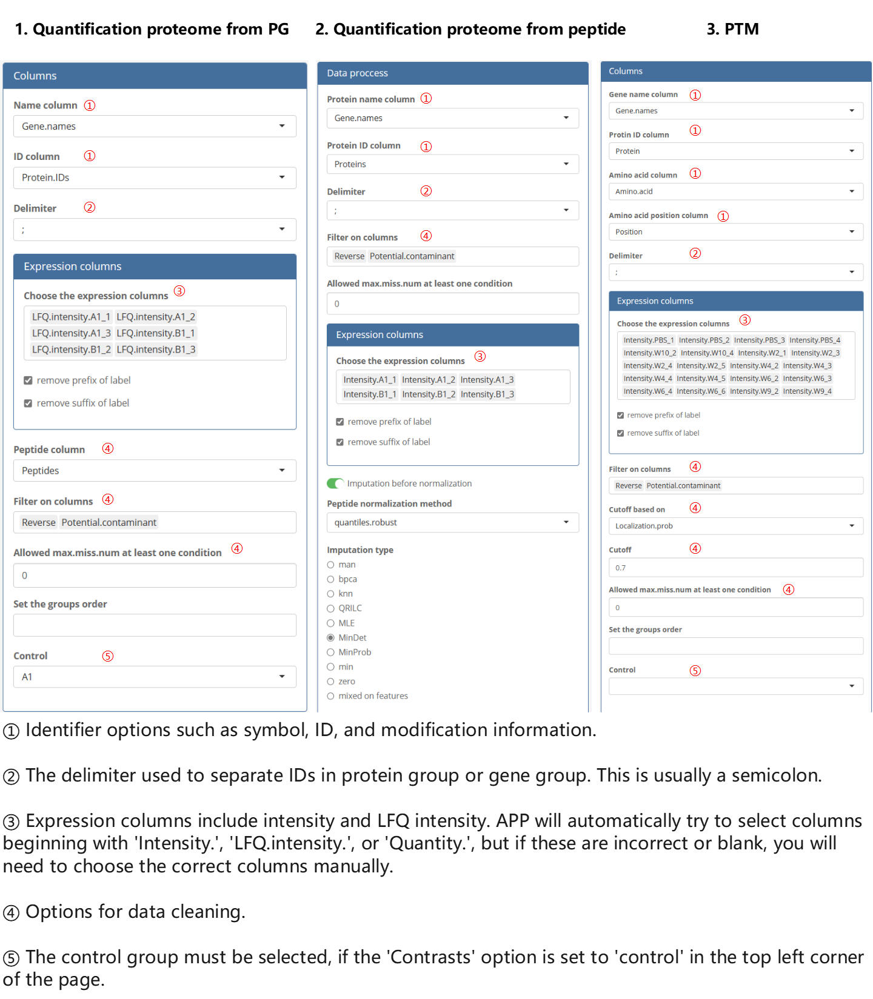
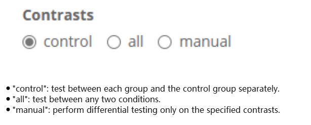
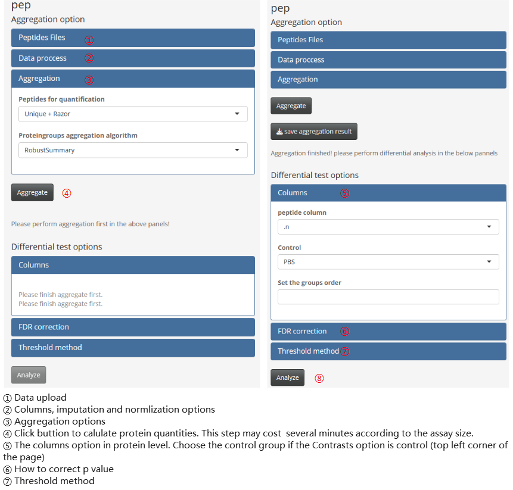
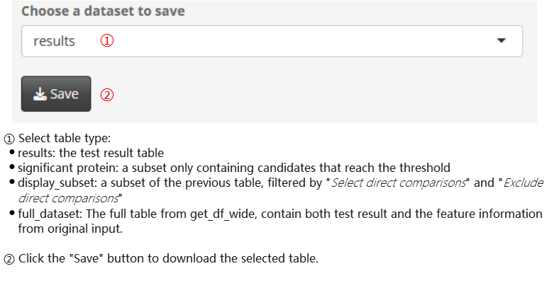

```{r, include=FALSE}
knitr::opts_chunk$set(echo = TRUE, fig.align="center")
```

# Introduction

DEP2 contains a shiny application for the researchers without programming experience. The application provides a easy-used GUI to perform most analysis in DEP2. We will briefly summary the app operation. We put the example tables on this [repository](https://github.com/mildpiggy/OmicsExample?_blank).

# Run App

The application can be invoked by executing a single commond.

```{r run,eval=FALSE}
DEP2::run_app()
```


# Add Module

In DEP2, the shiny application is designed in modules. Different analysis functionalists are divided into different modules. And mocules can be import in the add moudle button.





Now, the app contains following modules:

1. The omics modules

    - **Quantificated proteome(based on proteingroup quantification)**

        Differential analysis of protein-level quantitative data, like intensity, LFQ.intensity or quantity tables.

    - **Quantificated proteome(based on peptide quantification)**

        Analysis differentially expression protein upon the re-aggregated quantities from peptide-level quantitative data. 

    - **Modification-specific proteome(modified peptide quantification)**

        Analysis differentially enriched modification-specific peptides, receiving peptide quantity from modification-specific enrichment.
        
    - **Transcriptome(RNA counts)**
    
        Differential analysis of parallel transcriptome based on package DEseq2.

2. The post analysis modules

    - **Over-representation analysis**
    
        The biological functional enrichment by `test_ora`.
    
    - **GSEA**
    
        Another biological functional enrichment by `test_gsea`.
    
    - **Protein-protein interaction**
    
        Construct PPI network using a local STRING database by test_ppi. If local data is absent ()
    
    - **Timecourse cluster**
    
        Soft cluster on multi-groups assay.
    
    - **Integrated analysis**
    
        Compare results between omics experiments (PTM data isn't supported yet).


# Omics Analysis Module


## Upload table
    
Three type to upload table: 
        
  a. Only upload expression table. The experiment design is generated from expression column names. The colnames must under such rule, (condition)_(repeataion), for example, *control_1*, *treat_1*.
            
  b. Upload both expression table and experiment design table.
        
  c. Upload a saved logfile from previous analysis, and recovery the analysis options
        
The application accepts tables in *.txt* (tab separated), *.csv* (comma separated) or *.gz* (compressed table) format. 
Log file is in a *.logrds* format and is saved from a previous analysis module.
    


## Set columns options

Set a correct read-in option including: identifiers, expression values and filter columns.


{width=1000px}

## Set analysis options

Set the test mode.

{width=400px}

Other options can be adjusted in option pannels.


Besides, the peptide-protein aggregation pipeline contains two main calculate step, aggregation and differential test. They should perform step by step in the module.




## Result export


